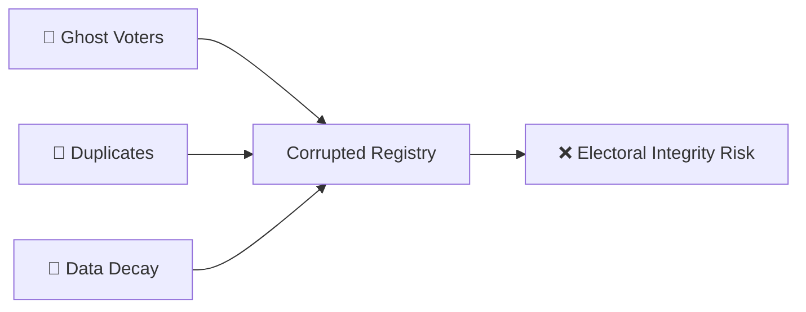
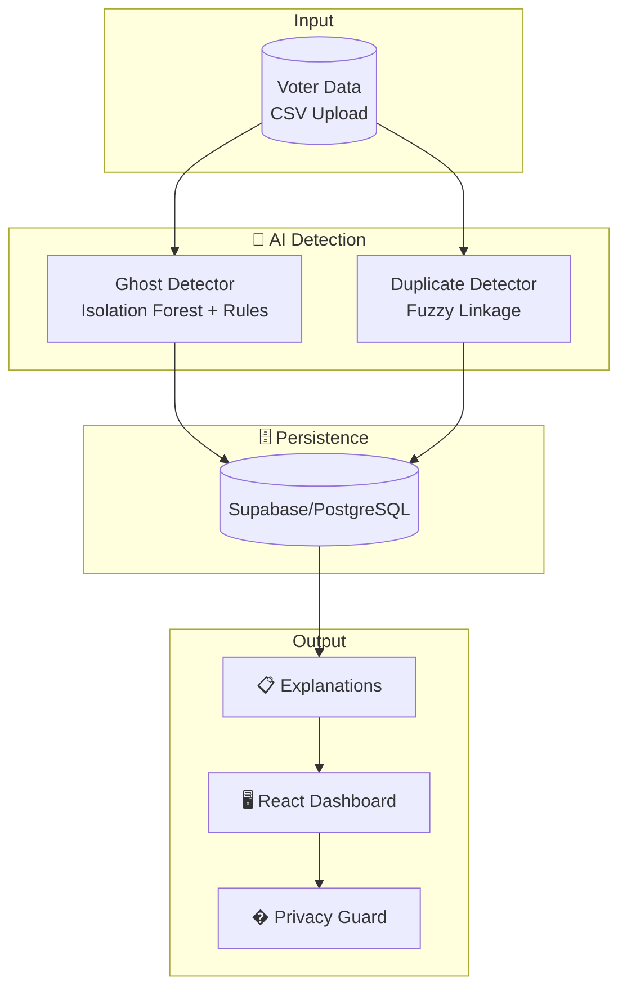

# 🛡️ VoteGuard - Implementation Plan

> **AI-powered system to detect ghost and duplicate voters with explainable results.**

---

## 🎯 The Problem



| Problem | Description |
|---------|-------------|
| **Ghost Voters** | Deceased/migrated individuals still on rolls (Anomalous age/inactivity) |
| **Duplicates** | Same person registered multiple times (Fuzzy name matching + DOB/Pincode collisions) |
| **Manual Review** | Too slow for millions of records; needs AI prioritization |

---

## ✅ Our Solution



---

## 🔧 Tech Stack

| Component | Technology |
|-----------|------------|
| **ML Engine** | Python, Scikit-Learn (Isolation Forest), RapidFuzz |
| **Backend** | Flask REST API, SQLAlchemy |
| **Database** | Supabase (PostgreSQL) / SQLite Fallback |
| **Frontend** | React (Vite), Tailwind CSS, Lucide Icons, Recharts |
| **Security** | Privacy Guard (PII Masking), Immutable Audit Logs |

---

## 🤖 How Detection Works

### Ghost Voter Detection
**Model:** Isolation Forest (Unsupervised) + Deterministic Inactivity Rules.
- **Rules:** Age > 110 OR Last voted before 2000.
- **ML Anomaly:** Detects statistical outliers in voting frequency and registration age.
- **XAI:** Generates confidence scores based on feature contribution (Age, Voting Gap).

### Duplicate Detection
**Model:** Smart Fuzzy Linkage.
1. **Blocking:** Group by **DOB + Pincode** (O(N) efficiency).
2. **Matching:** RapidFuzz `token_sort_ratio` (>=85%) within clusters.
3. **Validation:** Checks for name inversions and phonetic similarities.

---

## 📁 Project Architecture

```
VEXORA-26_Algo_Titans/
├── 🤖 ml/                  # Detection Core
│   ├── preprocessor.py     # Feature engineering
│   ├── ghost_detector.py   # Isolation Forest logic
│   ├── duplicate_detector.py# Fuzzy clustering
│   └── explainer.py        # XAI (Explainable flags)
│
├── ⚡ api/                 # Backend
│   ├── app.py              # REST Endpoints (Optimized O(N+M))
│   └── models.py           # DB Schema (Voters, AuditSessions)
│
├── 🖥️ react-frontend/      # Command Center
│   ├── src/App.jsx         # Executive Dashboard
│   └── src/App.css         # Premium Glassmorphism UI
│
└── 📊 data/                # Sample Datasets
```

---

## ⚡ Performance Optimizations
- **O(N+M) Data Sync**: Optimized the database ingestion loop using vectorized filtering, allowing analysis of 15k+ records in under 2 seconds.
- **Clean Slate Protocol**: Instant synchronization between ML results and database persistence.
- **Robust Error Handling**: Frontend handles server timeouts and malformed JSON gracefully.

---

## ⚖️ Ethical Safeguards & Privacy
- **Human-in-the-Loop**: AI flags records; human auditors make the final "Approve" or "Delete" decision.
- **Privacy Guard Mode**: Toggleable PII masking for public audits.
- **Audit Logging**: Every action is serialized and logged for forensic review.

---

## 👥 Team: Algo Titans
### Project Status: 🚀 Initial Implementation Complete & Pushed to GitHub

**VEXORA-26 Hackathon**
