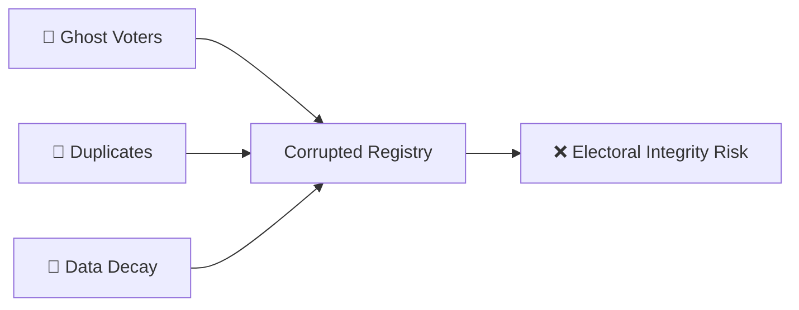
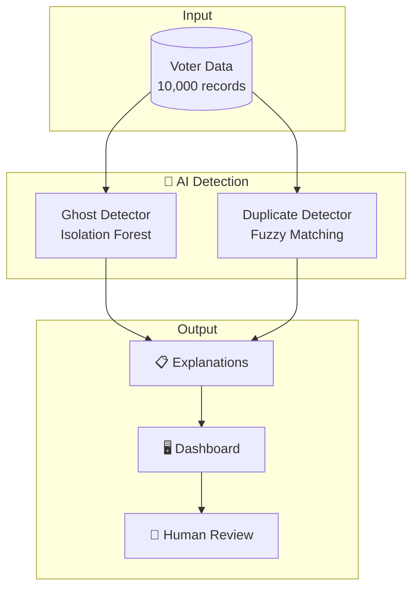
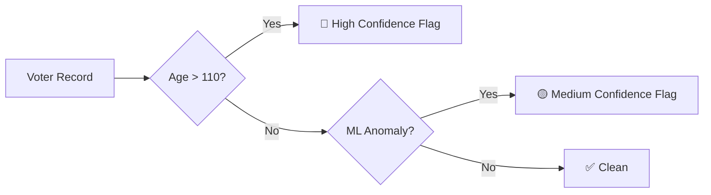
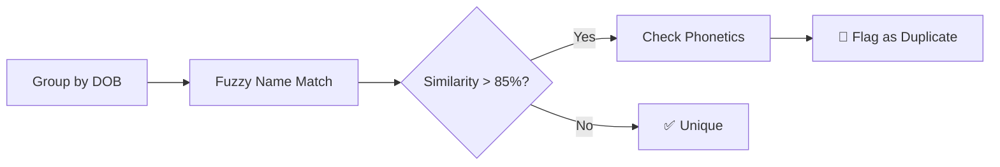
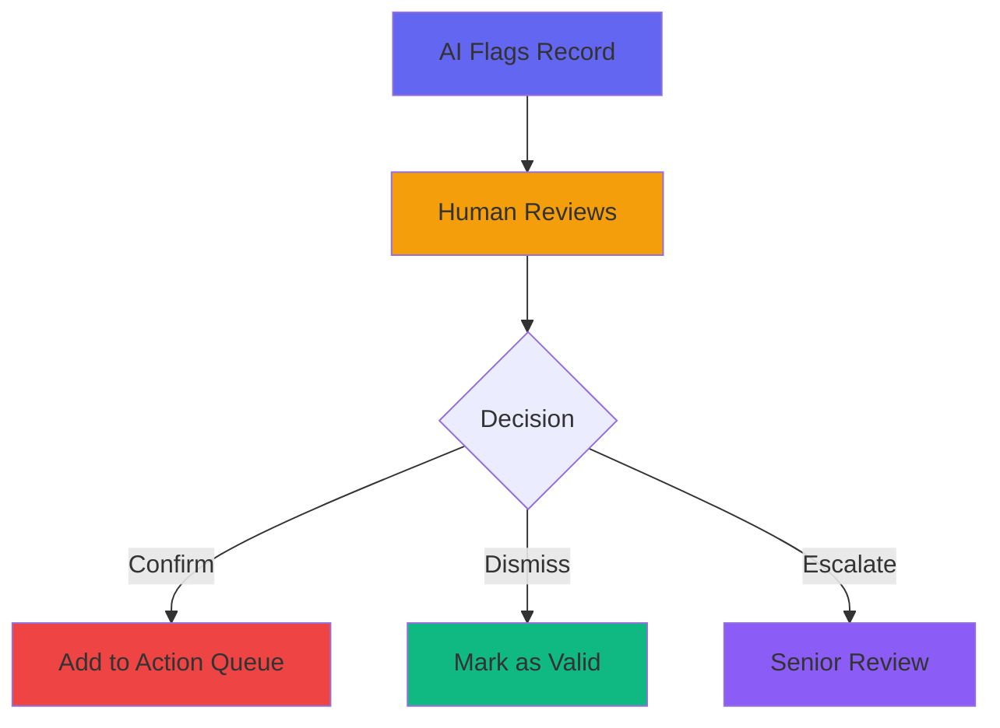

# 🛡️ VoteGuard - Implementation Plan

> **AI-powered system to detect ghost and duplicate voters**

---

## 🎯 The Problem



| Problem | Description |
|---------|-------------|
| **Ghost Voters** | Deceased/migrated individuals still on rolls |
| **Duplicates** | Same person registered multiple times |
| **Manual Review** | Too slow for millions of records |

---

## ✅ Our Solution



---

## 🔧 Tech Stack

| Component | Technology |
|-----------|------------|
| **ML Engine** | Python, scikit-learn, RapidFuzz |
| **Backend** | Flask REST API |
| **Frontend** | HTML/CSS/JS + Chart.js |

---

## 🤖 How Detection Works

### Ghost Voter Detection


**Key Indicators:**
- Age exceeds 110 years
- No voting activity in 20+ years
- Registration before 1970

### Duplicate Detection


**Matching Criteria:**
- Same Date of Birth (required)
- Name similarity > 85%
- Phonetic match (Soundex/Metaphone)

---

## 🖥️ System Architecture

```
┌────────────────────────────────────────────────────────┐
│                    VOTEGUARD SYSTEM                    │
├──────────────┬──────────────┬──────────────────────────┤
│   ML Module  │   Flask API  │   Web Dashboard          │
│  ──────────  │  ──────────  │  ─────────────           │
│  • Preprocess│  /analyze    │  📊 Statistics           │
│  • Ghost Det.│  /flagged    │  📋 Flagged Records      │
│  • Dup. Det. │  /review     │  🔍 Detail Modal         │
│  • Explainer │  /audit-log  │  ✅ Review Actions       │
└──────────────┴──────────────┴──────────────────────────┘
```

---

## 📁 Project Files

```
VEXORA-26_Algo_Titans/
├── 🤖 ml/
│   ├── preprocessor.py      # Data cleaning
│   ├── ghost_detector.py    # Anomaly detection
│   ├── duplicate_detector.py# Fuzzy matching
│   └── explainer.py         # Generate reasons
│
├── ⚡ api/
│   └── app.py               # REST endpoints
│
├── 🖥️ frontend/
│   ├── index.html           # Dashboard UI
│   ├── styles.css           # Dark theme
│   └── app.js               # API integration
│
└── 📊 voter_data.csv        # 10,000 test records
```

---

## ⚖️ Ethical Safeguards



> **Key Principle:** AI assists, humans decide. No automated deletions.

---

## 🚀 Quick Start

```bash
# 1. Install dependencies
pip install -r requirements.txt

# 2. Start server
python api/app.py

# 3. Open browser
# → http://localhost:5000
```

---

## 👥 Team: Algo Titans

**VEXORA-26 Hackathon**
